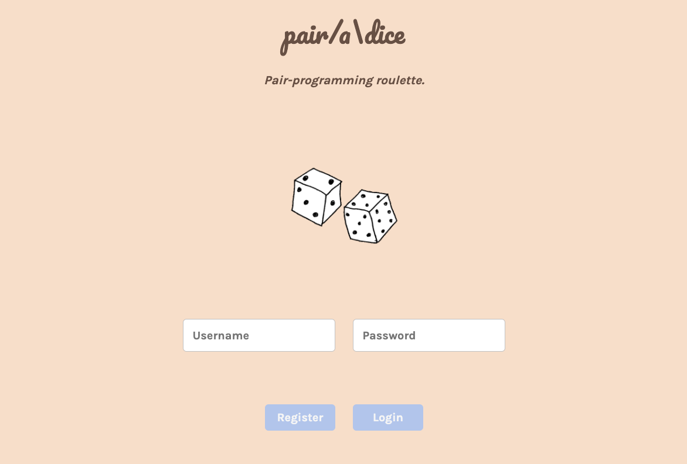
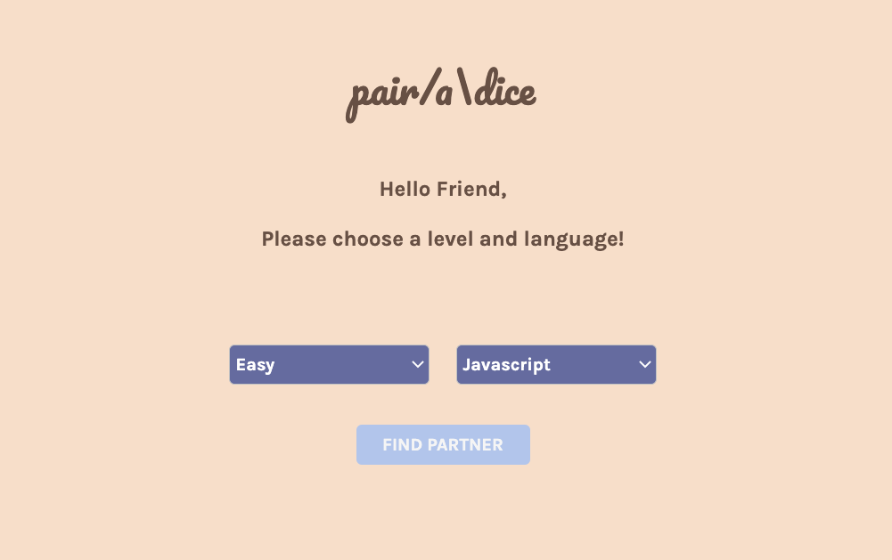
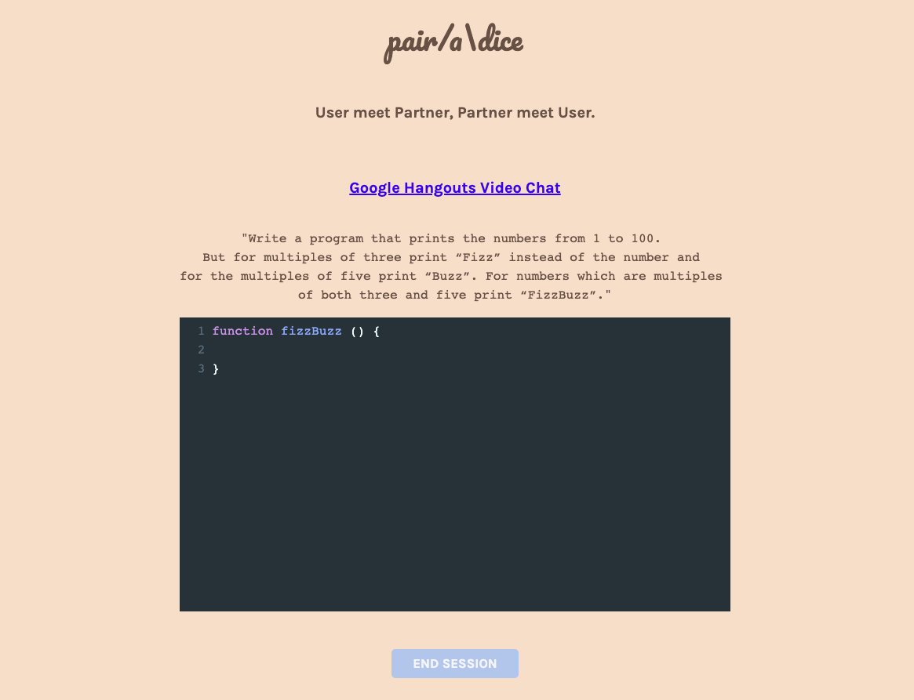

<!-- PROJECT SHIELDS -->
<!--
*** I'm using markdown "reference style" links for readability.
*** Reference links are enclosed in brackets [ ] instead of parentheses ( ).
*** See the bottom of this document for the declaration of the reference variables
*** for contributors-url, forks-url, etc. This is an optional, concise syntax you may use.
*** https://www.markdownguide.org/basic-syntax/#reference-style-links
-->
<!-- [![Contributors][contributors-shield]][contributors-url]
[![Forks][forks-shield]][forks-url]
[![Stargazers][stars-shield]][stars-url]
[![Issues][issues-shield]][issues-url]
[![MIT License][license-shield]][license-url]
[![LinkedIn][linkedin-shield]][linkedin-url] -->

<!-- PROJECT LOGO -->
[](https://github.com/Pair-a-Dice-2-0/Pair-a-Dice-2.0)
<br />
<p align="center">
 <p align="center">
  
     </p>

  <p align="center">
    A live pair-programming partner finder with integrated IDE.
    <br />
    <br />
    ·
    <a href="https://github.com/Pair-a-Dice/pair-a-dice_repo/issues">Report Bug</a>
    ·
    <a href="https://github.com/Pair-a-Dice/pair-a-dice_repo/issues">Request Feature</a>
  </p>
</p>

<!-- TABLE OF CONTENTS -->

## Table of Contents

- [About the Project](#about-the-project)
  - [Built With](#built-with)
  - [Installation](#installation)
- [Usage](#usage)
- [Roadmap](#roadmap)
- [Contributing](#contributing)
- [License](#license)

<!-- ABOUT THE PROJECT -->

## About The Project

<!-- [![Product Name Screen Shot][product-screenshot]](https://example.com) -->

Pair/a\Dice was created for developers to find an online pair-programming partner and practice their coding skills through our integrated IDE. We currently support JavaScript, Python, and C. The project is currently in Beta.

### Built With

- [Redux](https://redux.js.org/)
- [CodeMirror](https://codemirror.net/)
- [Socket.io](https://socket.io/)

<!-- GETTING STARTED -->
<!-- ## Getting Started -->

<!-- ### Prerequisites

This is an example of how to list things you need to use the software and how to install them.
* npm
```sh
npm install npm@latest -g
``` -->

### Installation

1. Fork the repo
2. Clone the repo

```sh
git clone https://github.com/Pair-a-Dice-2-0/Pair-a-Dice-2.0.git
```

3. Start server and app

```sh
npm install
```

```sh
npm run dev
```

<!-- USAGE EXAMPLES -->

## Usage

Register with your unique username and password, and sign in. PairaDice will keep all of your personal information confidential.<br />

<p align="center">
 <br />
</p>

Choose a programming language and difficulty. Then you will be matched with a pair-programming partner.<br />

<p align="center">
 <br />
</p>

Use our integrated IDE to solve algorithms and feel free to video chat with your partner through Google Hangouts.<br />

<p align="center">
 <br />
</p>

<!-- _For more examples, please refer to the [Documentation](https://example.com)_ -->

<!-- ROADMAP -->

## Roadmap

See the [open issues](https://github.com/Pair-a-Dice/pair-a-dice_repo/issues) for a list of proposed features (and known issues).

<!-- CONTRIBUTING -->

## Contributing

Contributions are what make the open source community such an amazing place to be learn, inspire, and create. Any contributions you make are **greatly appreciated**.

1. Fork the Project
2. Create your Feature Branch (`git checkout -b feature/AmazingFeature`)
3. Commit your Changes (`git commit -m 'Add some AmazingFeature'`)
4. Push to the Branch (`git push origin feature/AmazingFeature`)
5. Open a Pull Request to the pairadice staging branch

<!-- LICENSE -->

## License

Distributed under the MIT License. See `LICENSE` for more information.

## Contributors

<table>
  <tr>
    <td align="center"><a href="https://github.com/akim3235"><br /><sub><b>Alexander Kim</b></sub></a></td>
    <!-- SPACE -->
    <td align="center"><a href="https://github.com/amyy98"><br /><sub><b>Amy Yee</b></sub></a></td>
    <!-- SPACE -->
    <td align="center"><a href="https://github.com/dylanrh"><br /><sub><b>Dylan Hensel</b></sub></a></td>
    <!-- SPACE -->
    <td align="center"><a href="https://github.com/joalk"><br /><sub><b>Joal Kim</b></sub></a></td>
   <!-- SPACE -->

   <br>
   <td align="center"><a href="https://github.com/LiamMcB"><br /><sub><b>Liam McBride</b></sub></a></td>
    
  </tr>
  </table>