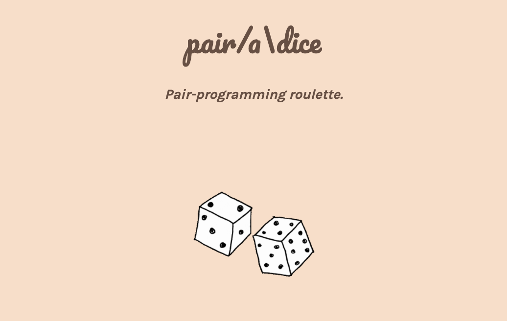

<!-- PROJECT SHIELDS -->
<!--
*** I'm using markdown "reference style" links for readability.
*** Reference links are enclosed in brackets [ ] instead of parentheses ( ).
*** See the bottom of this document for the declaration of the reference variables
*** for contributors-url, forks-url, etc. This is an optional, concise syntax you may use.
*** https://www.markdownguide.org/basic-syntax/#reference-style-links
-->
<!-- [![Contributors][contributors-shield]][contributors-url]
[![Forks][forks-shield]][forks-url]
[![Stargazers][stars-shield]][stars-url]
[![Issues][issues-shield]][issues-url]
[![MIT License][license-shield]][license-url]
[![LinkedIn][linkedin-shield]][linkedin-url] -->


<!-- PROJECT LOGO -->
<br />
<p align="center">
  <a href="https://github.com/othneildrew/Best-README-Template">
    
  </a>
 <p align="center">
  
     </p>

  <p align="center">
    A live pair-programming partner finder with integrated IDE.
    <br />
    <br />
    <br />
    ·
    <a href="https://github.com/Pair-a-Dice/pair-a-dice_repo/issues">Report Bug</a>
    ·
    <a href="https://github.com/Pair-a-Dice/pair-a-dice_repo/issues">Request Feature</a>
  </p>
</p>


<!-- TABLE OF CONTENTS -->
## Table of Contents

* [About the Project](#about-the-project)
  * [Built With](#built-with)
  * [Installation](#installation)
* [Usage](#usage)
* [Roadmap](#roadmap)
* [Contributing](#contributing)
* [License](#license)


<!-- ABOUT THE PROJECT -->
## About The Project

<!-- [![Product Name Screen Shot][product-screenshot]](https://example.com) -->
Trail Traffic was created to make outdoor activities safer and more convenient—so you can avoid the crowds at popular hiking spots. The project is currently in Beta.

### Built With

* [Redux](https://redux.js.org/)
* [CodeMirror](https://codemirror.net/)
* [Socket.io](https://socket.io/)


<!-- GETTING STARTED -->
<!-- ## Getting Started -->


<!-- ### Prerequisites

This is an example of how to list things you need to use the software and how to install them.
* npm
```sh
npm install npm@latest -g
``` -->

### Installation

1. Fork the repo
2. Clone the repo
```sh
git clone https://github.com/Pair-a-Dice-2-0/Pair-a-Dice-2.0.git
```
3. Start server and app
```sh
npm install
```
```sh
npm run dev
```
<b>Note: to run heatmap data, you will need to get your own access token to the besttime.app API and store all location, public, and private key variables in a file called secrets.js in the project's root directory</b>


<!-- USAGE EXAMPLES -->
## Usage
View five popular trails in Los Angeles and a heatmap displaying their current traffic.     <br />
<p align="center">
 <br />
     </p>
To keep track of favorites, sign up with your Google account (accessed via the bottom right nav tab). Trail Traffic will keep all of your personal information confidential.
<p align="center">
 <br />
</p>

<!-- _For more examples, please refer to the [Documentation](https://example.com)_ -->


<!-- ROADMAP -->
## Roadmap

See the [open issues](https://github.com/wellhaus/path-19.git/issues) for a list of proposed features (and known issues).


<!-- CONTRIBUTING -->
## Contributing

Contributions are what make the open source community such an amazing place to be learn, inspire, and create. Any contributions you make are **greatly appreciated**.

1. Fork the Project
2. Create your Feature Branch (`git checkout -b feature/AmazingFeature`)
3. Commit your Changes (`git commit -m 'Add some AmazingFeature'`)
4. Push to the Branch (`git push origin feature/AmazingFeature`)
5. Open a Pull Request to the path-19 staging branch


<!-- LICENSE -->
## License

Distributed under the MIT License. See `LICENSE` for more information.


<!-- CONTACT -->
<!-- ## Contact

Coming soon! -->

<!-- Your Name - [@your_twitter](https://twitter.com/your_username) - email@example.com

Project Link: [https://github.com/your_username/repo_name](https://github.com/your_username/repo_name) -->


<!-- ACKNOWLEDGEMENTS -->
<!-- ## Acknowledgements

Coming soon! -->

<!-- * [GitHub Emoji Cheat Sheet](https://www.webpagefx.com/tools/emoji-cheat-sheet)
* [Img Shields](https://shields.io)
* [Choose an Open Source License](https://choosealicense.com)
* [GitHub Pages](https://pages.github.com)
* [Animate.css](https://daneden.github.io/animate.css)
* [Loaders.css](https://connoratherton.com/loaders)
* [Slick Carousel](https://kenwheeler.github.io/slick)
* [Smooth Scroll](https://github.com/cferdinandi/smooth-scroll)
* [Sticky Kit](http://leafo.net/sticky-kit)
* [JVectorMap](http://jvectormap.com)
* [Font Awesome](https://fontawesome.com) -->
